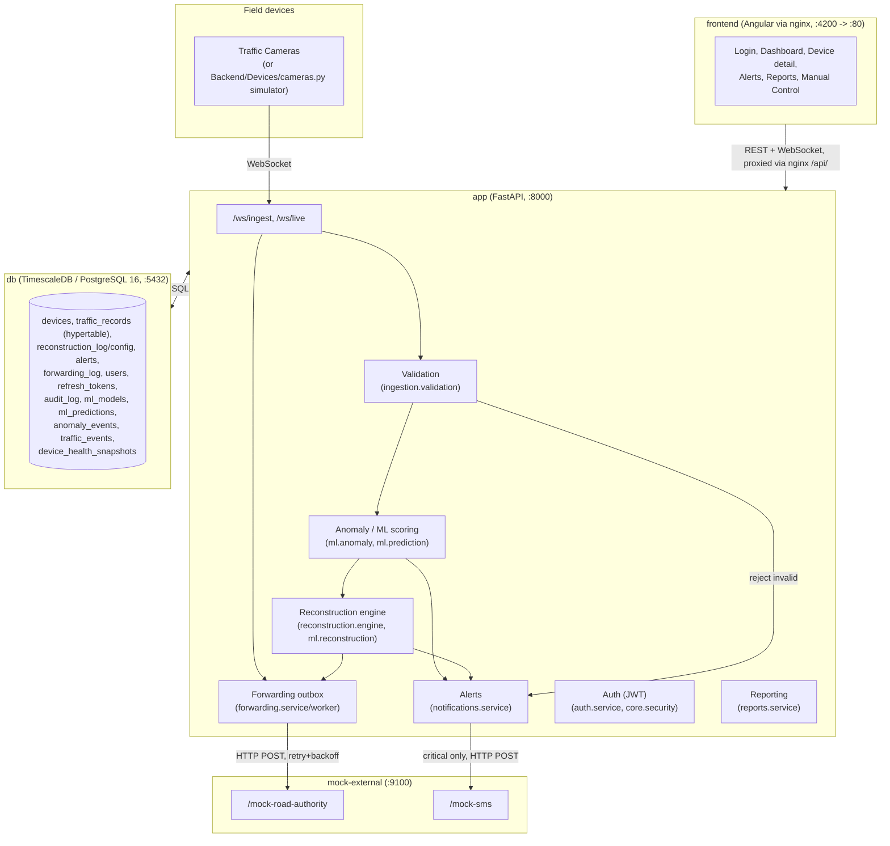

# Architecture Diagram

Matches the real `docker-compose.yml` topology (5 services) and the
backend's actual domain breakdown (`Backend/app/domains/*`).

Five Docker Compose services, no additional infrastructure (no
Redis/Celery/Kubernetes — the pipeline runs entirely inside `app`'s own
background asyncio tasks: reconstruction worker, forwarding worker, ML
health-scan worker, ML retrain worker, all started in `main.py`'s
`lifespan`).
