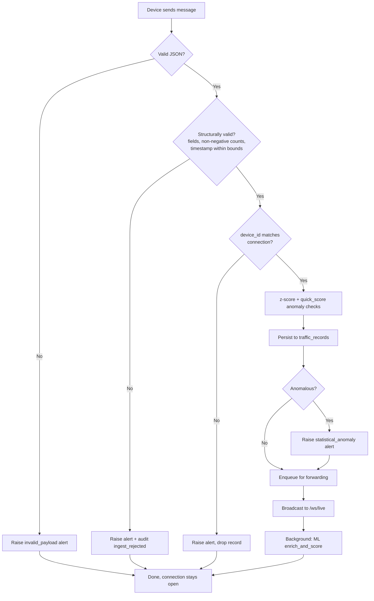

# Report 2 — Analysis and Design

## Requirements

No formal SRS document exists in this repository (see README's opening
note); the requirements below are reconstructed from the actually
implemented behaviour, not from an external spec.

### Functional requirements (implemented)

1. Authenticate operators via username/password, issue short-lived JWTs
   plus rotating refresh tokens.
2. Accept device readings over a WebSocket gateway, authenticated by a
   shared per-device token.
3. Reject structurally invalid payloads (missing fields, negative counts,
   bad/out-of-range timestamps) without storing them or crashing the
   ingestion loop.
4. Detect statistically anomalous readings using both a z-score check and
   a robust MAD/rule-violation check; optionally combine with a trained
   model's prediction residual.
5. Detect missing intervals per device (based on `expected_interval_seconds`
   and a configurable grace period) and device-health degradation
   (silent/intermittent/constant-value/partial-failure/bursting/
   timestamp-drift/rate-mismatch).
6. Reconstruct missing intervals through a confidence-gated hierarchy,
   never presenting a low-confidence estimate as trusted, and always
   logging the attempt.
7. Let an operator manually override any stored/reconstructed value, with
   the change fully audited (actor, reason, resulting value).
8. Raise alerts for invalid payloads, anomalies, device-health changes, and
   forwarding failures; push them live to connected dashboards; send SMS
   only for critical severity.
9. Forward validated/reconstructed readings to an external road-authority
   endpoint with retry/backoff, and let an operator manually retry a failed
   one.
10. Provide a filterable JSON/CSV report of stored readings.
11. Record an audit trail of logins, rejections, overrides,
    reconstructions, forwarding attempts, and config changes.

### Non-functional requirements (implemented)

- The ingestion loop must never crash on malformed device input (verified
  by `test_scenarios.py --scenario invalid-json` / `invalid-structure`).
- Reconstruction/forwarding tuning must not require a redeploy —
  `reconstruction_config` is a DB-backed, API-editable table; forwarding
  intervals/backoff/thresholds are environment variables.
- The system must degrade gracefully, not fail to start, if an optional ML
  dependency (`scikit-learn`, `jdatetime`) or the OpenRouter explanation
  service is unavailable.
- Every consequential action must be attributable to an actor in the audit
  log.

## Actors

- **Authenticated user** — logs in, uses the dashboard/reports/manual
  control UI. (The `users.role` column exists but is not currently used to
  distinguish an Administrator from an Operator — see README Limitations;
  this project does not claim role-based access control it doesn't have.)
- **Traffic counting device** (camera or simulator) — the only unauthenticated-as-a-user
  actor; authenticates to the ingestion gateway with a shared device token,
  not a user account.
- **External Road Authority** — the forwarding target, mocked in dev by
  `Backend/mock_external/server.py`.
- **SMS Gateway** — the critical-alert delivery channel, also mocked.

Use cases and their relationships: see
[docs/USE_CASE_DIAGRAM.md](USE_CASE_DIAGRAM.md).

## Sequence diagrams

See [docs/SEQUENCE_DIAGRAMS.md](SEQUENCE_DIAGRAMS.md): device ingestion,
missing-data/reconstruction, authentication, and reporting.

## Activity: one ingested reading, end to end

## Architecture

See [docs/ARCHITECTURE_DIAGRAM.md](ARCHITECTURE_DIAGRAM.md).

## Design decisions worth calling out

- **Two independent anomaly opinions rather than one**: the existing
  z-score check and the newer ML-layer `quick_score` both run, and either
  can flag a record — a deliberate redundancy rather than a replacement, so
  removing/disabling the ML layer (`TCMS_ML_ENABLED=false`) never drops
  ingestion-time anomaly detection to zero.
- **Never fabricate a confident reconstruction**: every level in the
  reconstruction hierarchy returns `None` rather than a low-quality guess
  when it doesn't have enough signal; the policy layer's `MANUAL_REVIEW`
  outcome exists specifically so nothing is silently trusted.
- **Raw payload preservation**: `traffic_records.raw_payload` is never
  overwritten once set, even when a row is later reconstructed or manually
  overridden — the original device observation is always recoverable.
- **Forwarding as a durable outbox, not a direct call**: ingestion enqueues
  a row and returns immediately; a separate worker drains it with
  backoff — a slow/unavailable road-authority endpoint can never block
  ingestion.
