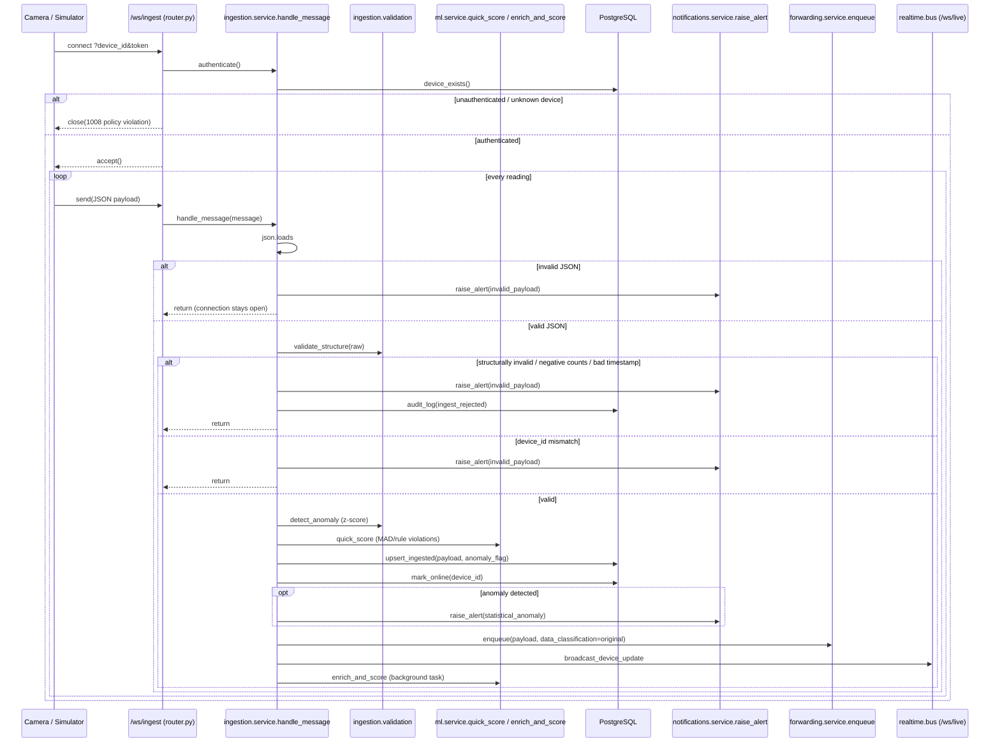
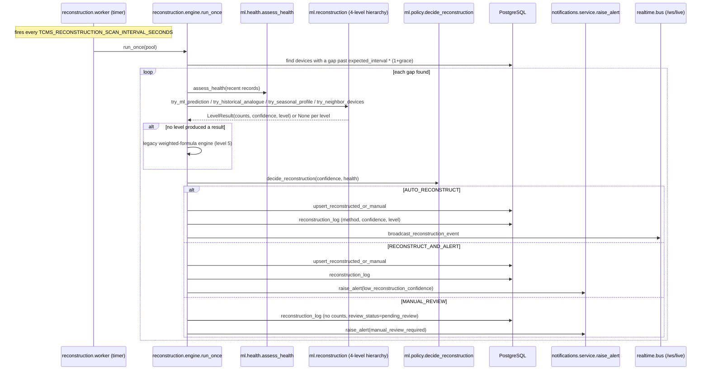
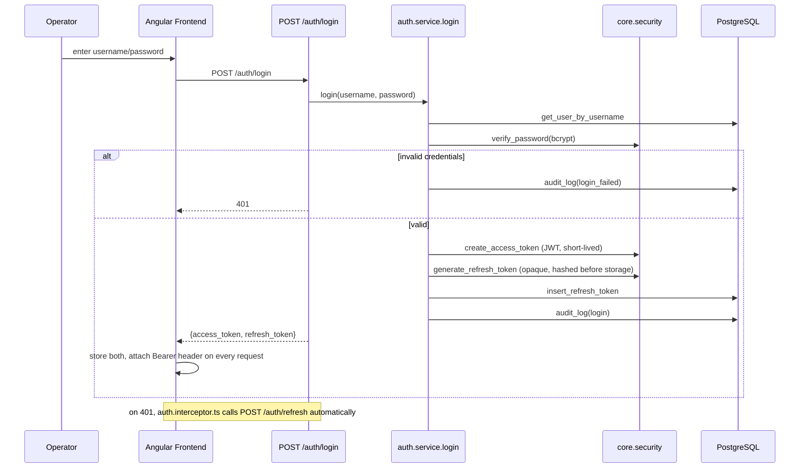
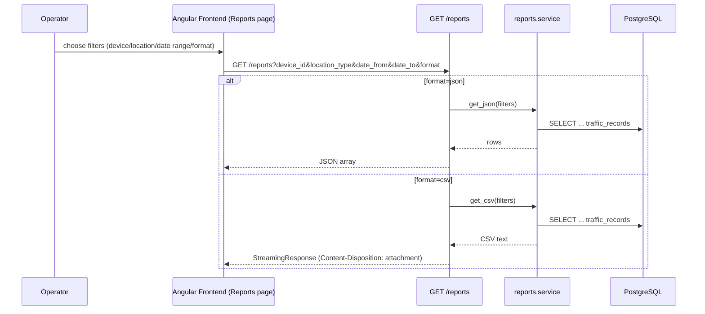

# Sequence Diagrams

Every actor and step name below matches a real function/endpoint in the
codebase (file references given), not a generic placeholder.

## A. Device ingestion

Files: `Backend/app/domains/ingestion/router.py`,
`Backend/app/domains/ingestion/service.py::handle_message`.

## B. Missing data / reconstruction

Files: `Backend/app/domains/reconstruction/engine.py`,
`Backend/app/ml/reconstruction.py`, `Backend/app/ml/health.py`.

## C. Authentication

Files: `Backend/app/domains/auth/router.py`,
`Backend/app/domains/auth/service.py`, `Backend/app/core/security.py`.

## D. Reporting

Files: `Backend/app/domains/reports/router.py`,
`Backend/app/domains/reports/service.py`.

