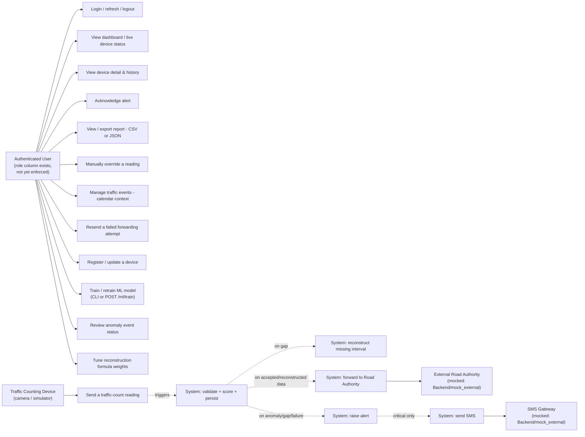

# Use Case Diagram

Actors and use cases strictly reflect what is implemented — nothing here is
invented. Two roles named in the SRS-style code comments (Administrator,
Operator) are **not actually distinguished** in the codebase: the `users`
table has a `role` column but every domain router depends only on
`get_current_user` with no role check, so there is one authenticated-user
permission level in practice. That's shown below as a single
"Authenticated User" actor with a note, rather than inventing two enforced
roles.

